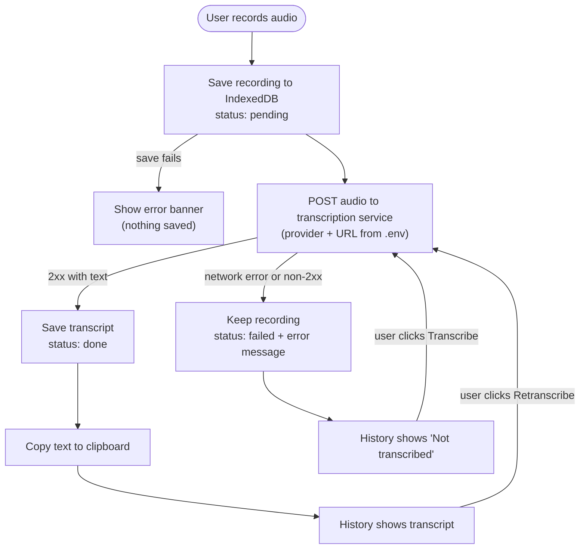

# Audio Translator

A React web application for recording audio and transcribing it to text using a **local Whisper service** running on this machine ([careless_whisper](../../python/careless_whisper), managed by launchd). No audio leaves your computer. Built with React 18, Vite, and Bootstrap.

## Features

- 🎤 **Audio Recording**: Record audio with live visualization
- 🔄 **Speech-to-Text Translation**: Convert audio to text using the local Whisper API
- 🔄 **Reprocess Translations**: Re-run translation on existing audio recordings
- 💾 **Local Storage**: Store recordings and translations locally using IndexedDB
- 📋 **Auto-Copy**: Automatically copy latest translation to clipboard
- 📚 **Translation History**: Browse and manage previous translations
- 📤 **Export Options**: Export data to JSON, SQLite, or MongoDB
- 🎨 **Modern UI**: Clean interface built with React Bootstrap
- 📖 **Storybook**: Component documentation and testing

## Tech Stack

- **React 18**
- **Vite** - Fast build tool
- **Bootstrap 5** - Responsive UI framework
- **Dexie** - IndexedDB wrapper for local storage
- **Storybook** - Component development environment

## Getting Started

### Prerequisites

- Node.js 18+ 
- npm or yarn
- The local transcription service installed and running (see [Local Transcription Service](#local-transcription-service))

### Installation

1. Clone the repository and enter it:
```bash
git clone <repository-url>
cd careless_whisper_ui
```

2. Install dependencies:
```bash
npm install
```

3. Copy environment variables:
```bash
cp .env.example .env
```

4. (Optional) Adjust `.env` if your service runs elsewhere or you want a different model. Defaults work with the stock launchd setup.

### Development

Start the development server:
```bash
npm run dev
```

Start Storybook:
```bash
npm run storybook
```

### Build

Build for production:
```bash
npm run build
```

## Configuration

### Environment variables

| Variable | Default | Description |
| --- | --- | --- |
| `VITE_TRANSCRIPTION_PROVIDER` | `local` | `local` (careless_whisper API) or `openai` (any OpenAI-compatible server) |
| `VITE_TRANSCRIPTION_API_URL` | provider default (`http://localhost:8765` / `https://api.openai.com/v1`) | Base URL override, use your own endpoint |
| `VITE_WHISPER_MODEL` | `base` (local) / `whisper-1` (openai) | Model name sent to the service |
| `VITE_TRANSCRIPTION_API_KEY` | _empty_ | Optional bearer token (bundled into client code, not a secret) |

Vite only exposes variables prefixed with `VITE_`; restart `npm run dev` after changing `.env`.

Google Speech-to-Text and Azure Speech were listed in earlier versions but never implemented, so they were removed.
To add a provider, add an entry to `providers` in `src/services/translationService.js`.

### Recording flow



1. Record → the audio is saved to IndexedDB immediately (status `pending`).
2. The app tries to transcribe it. On success the text is saved on the record (`done`) and copied to the clipboard.
3. On failure the recording stays saved with status `failed` and the error message. Use the **Transcribe** button in the history to retry.

See [docs/PRD.md](docs/PRD.md) for the full product description.

### Local Transcription Service

With the `local` provider, `src/services/translationService.js` sends each recording as multipart form data to
`POST {VITE_TRANSCRIPTION_API_URL}/transcribe-text-only?model={VITE_WHISPER_MODEL}` and uses the
returned `text`. Recordings are `audio/webm;codecs=opus`, which the API accepts (it needs `ffmpeg`).

The service lives in `~/code/python/careless_whisper` and runs as a launchd agent
(`com.marcogallegos.translateapi`). From that directory:

```bash
make load      # install the plist into ~/Library/LaunchAgents and start it
make status    # show launchd state, PID and recent logs
make logs      # tail stdout/stderr
make reload    # restart after changing api.py or the plist
make unload    # stop it
```

Verify it is up:

```bash
curl http://localhost:8765/health
```

The agent has `KeepAlive` and `RunAtLoad`, so it restarts on crash and at login.

### Troubleshooting

- **"Cannot reach transcription service"** – the agent is not running or the URL is wrong. Run `make status` in the service repo and `curl http://localhost:8765/health`.
- **`400 Unsupported file format`** – the API only accepts mp3, wav, m4a, ogg, flac, webm, mp4.
- **Slow first request** – the API loads the Whisper model on every request (model caching is commented out in `api.py`); use a smaller model (`tiny`/`base`) for faster results.
- **CORS errors** – the API allows all origins; if you still see one, the service is probably down (the browser reports it as CORS).

## Usage

1. **Record Audio**: Click the record button to start recording
2. **Live Visualization**: Watch the audio waveform while recording
3. **Auto-Translation**: Audio is automatically sent for translation when recording stops
4. **Auto-Copy**: Latest translation is automatically copied to clipboard
5. **Browse History**: View all previous translations in the history panel
6. **Reprocess Translations**: Click the reprocess button on any translation to re-run Whisper on the stored audio
7. **Export Data**: Export your translations to various formats

## Export Options

- **JSON**: Standard JSON format for backup or data analysis
- **SQLite**: SQL script to import into SQLite database
- **MongoDB**: JavaScript script for MongoDB import

## Browser Compatibility

- Chrome 88+
- Firefox 85+
- Safari 14+
- Edge 88+

Requires modern browser with MediaRecorder API support.

## Contributing

1. Fork the repository
2. Create a feature branch
3. Make your changes
4. Add tests and stories for new components
5. Submit a pull request

## License

MIT License - see LICENSE file for details