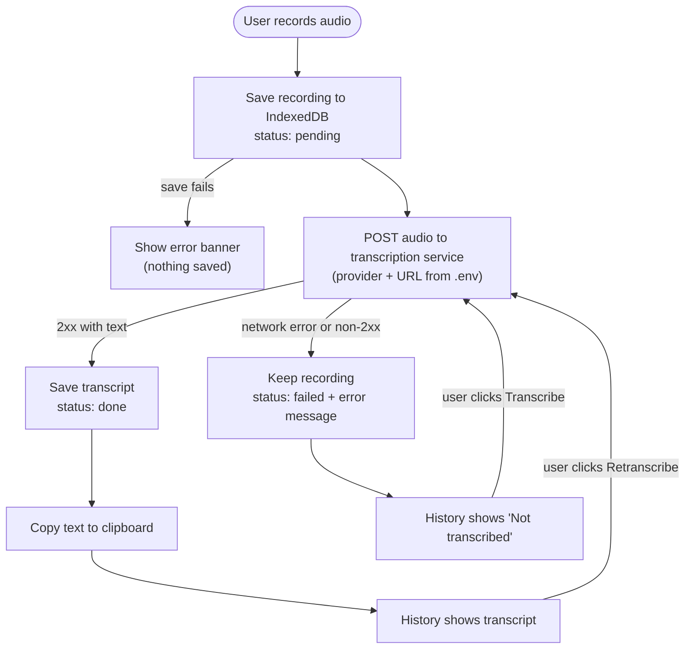

# PRD: Audio Translator (careless_whisper_ui)

Status: describes current behavior as of 2026-10-04. Not a roadmap.

## 1. Summary

A browser app to record audio and turn it into text. Recordings are always stored locally first; transcription is
a separate, retryable step performed by a configurable HTTP service. By default that service is the local
`careless_whisper` Whisper API running on the same Mac under launchd, so audio does not leave the machine.

## 2. Goals

- Never lose a recording: persist audio before any network call.
- Transcribe through a service the user controls; the endpoint must be swappable without code changes.
- Make failure cheap: if transcription fails, the user retries from the UI.
- Make the latest transcript instantly usable (auto-copy to clipboard).

## 3. Non-goals (current)

- No accounts, sync, or server-side storage; all data lives in the browser's IndexedDB.
- No streaming/live transcription; transcription starts after recording stops.
- No translation between languages, despite the "translation" naming in code. The service returns a transcript in the spoken language.
- No automatic retry/queue. Retry is manual.
- No Google/Azure providers (earlier config existed, never implemented).

## 4. Users

Single user (the owner) on a personal machine, using Chrome/Firefox/Safari with MediaRecorder support.

## 5. Core flow

### Functional requirements

| # | Requirement |
| --- | --- |
| F1 | User can record audio with a live waveform visualization; mic permission is requested via the browser. |
| F2 | Recordings are `audio/webm;codecs=opus` and are saved to IndexedDB (Dexie) with duration and timestamp **before** transcription starts. Initial record: `status: "pending"`, `text: ""`. |
| F3 | After saving, the app calls the transcription service once. On success the record is updated with `text`, `status: "done"`, `error: null`. |
| F4 | On failure (network error or non-2xx) the record keeps its audio and gets `status: "failed"` plus the error message. No global error banner; the failure is shown on the record. |
| F5 | Each history item has a button: **Transcribe** (pending/failed) or **Retranscribe** (done). It re-sends the stored audio, and the new result replaces the text. The recording timestamp is not changed. |
| F6 | Successful non-empty transcripts are copied to the clipboard automatically. |
| F7 | History lists recordings newest first with play, copy (disabled when no text), transcribe/retranscribe, delete (with confirmation, see F14). Empty successful transcripts show "(no speech detected)". |
| F8 | Export history as JSON, SQLite script, or MongoDB script (generated client-side; no database connection is made). Reached from the navbar menu (☰ → Export data), which opens a modal (full screen on phones). |
| F9 | Records created before `status` existed are treated as `done`. |
| F10 | Only one transcription runs at a time (UI disables record/transcribe buttons while one is in progress). |
| F11 | Keyboard: `R` toggles recording. Ignored in text fields, while a modal is open, while transcribing, with Ctrl/Cmd/Alt/Shift, and on key-repeat. A second press during the mic permission prompt is ignored. Start/stop is announced to screen readers (`aria-live`), and a key hint is shown on pointer/keyboard devices only. |
| F13 | Keyboard actions on the latest (newest) history item, using `Space` as a leader key (press `Space`, then the letter within 1s): `Space c` copy, `Space p` play/stop, `Space d` delete. `Space` therefore no longer toggles recording. The latest item is marked with a "Latest" badge and highlighted border; the shortcuts are shown as a hint and in button tooltips. |
| F14 | Deleting a recording **always** asks for confirmation (button or shortcut) in a modal showing the date, duration and transcript snippet. `Y` confirms, `N` or `Esc` cancels; "No" has the default focus. Deleting the item that is playing stops its audio. |
| F16 | Each history item with a transcript has **Translate** and **Agent** buttons that send the transcript to the configured endpoint (contract above). The reply is stored on the record (`translatedText`, `translatedLanguage`, `translatedAt` / `agentResponse`, `agentAt`) and shown under the item with a Copy link. Only one such call runs at a time; failures (endpoint not configured, unreachable, non-2xx, no text in reply) appear in the error banner and leave the record unchanged. |
| F17 | A Settings modal (navbar menu ☰ → Settings) edits all transcription/translate/agent settings. Defaults come from `.env`; entered values override them (localStorage, plain text); empty = default; "Reset to defaults" clears all overrides. Changes apply immediately without a reload. |
| F15 | After a mouse click, the record and history action buttons are blurred so a later `Space` keyup cannot re-activate them. Keyboard activation keeps focus. |
| F12 | Mic problems are reported in the error banner (permission denied, no microphone, other), not only in the console. |

## 6. Transcription service contract

Configured via `.env` (all `VITE_`-prefixed, read at build/dev start):

| Variable | Default | Purpose |
| --- | --- | --- |
| `VITE_TRANSCRIPTION_PROVIDER` | `local` | Request shape: `local` or `openai` |
| `VITE_TRANSCRIPTION_API_URL` | provider default | Base URL override (any host) |
| `VITE_WHISPER_MODEL` | `base` / `whisper-1` | Model name |
| `VITE_TRANSCRIPTION_API_KEY` | empty | Optional `Authorization: Bearer` |

Providers (`src/services/translationService.js`):

- `local`: `POST {url}/transcribe-text-only?model={model}`, multipart field `file`. Response `{ "text", "language", "processing_time" }`.
- `openai`: `POST {url}/audio/transcriptions`, multipart fields `file`, `model`. Response `{ "text" }`. Works with any OpenAI-compatible server.

Both send the file as `audio.<ext>` derived from the blob MIME type (webm by default). The service must accept
webm; the local API accepts mp3, wav, m4a, ogg, flac, webm, mp4 and requires `ffmpeg`.

### Settings and action endpoints

Effective settings are resolved on every call as: **Settings UI override (localStorage) > `.env` > built-in default**.
An empty override means "use the default". Covered settings: transcription (provider, URL, model, key), translation
(URL, target language, key) and agent (URL, key). See the README for the env var names.

The **Translate** and **Agent** history buttons `POST` JSON to their configured full URL (optional `Authorization: Bearer`):

- translate: `{ "action": "translate", "text", "target_language", "id", "timestamp" }`
- agent: `{ "action": "agent_instruction", "text", "id", "timestamp" }`

The response may be plain text, a JSON string, or a JSON object whose first string field among `text`, `translation`,
`translatedText`, `result`, `output`, `response`, `answer`, `message`, `content` is the result.

## 7. Local service (dependency)

Repo: `~/code/python/careless_whisper`. FastAPI + OpenAI Whisper, port **8765**, CORS open to all origins,
managed by launchd agent `com.marcogallegos.translateapi` (`RunAtLoad`, `KeepAlive`) via `make load|status|logs|reload|unload`.

## 8. Data model (IndexedDB `AudioTranslationDB.translations`)

| Field | Notes |
| --- | --- |
| `id` | `Date.now()` at record time (indexed key) |
| `timestamp` | ISO string of recording time (indexed) |
| `text` | Transcript, `""` until transcribed |
| `status` | `pending` / `done` / `failed` (not indexed) |
| `error` | Last failure message or `null` |
| `duration` | Seconds |
| `audioData` + `mimeType` | Audio bytes (ArrayBuffer) and type; turned back into a Blob on read |

No schema version bump was needed: `status` and `error` are non-indexed fields.

## 9. Known limitations / risks

- IndexedDB is per-browser/per-origin and can be cleared by the browser; export is the only backup.
- A page closed while status is `pending` leaves a record stuck as "Transcribing..."; the user can still click **Transcribe**.
- `VITE_*` API keys are shipped in the client bundle, and keys entered in Settings are stored in plain text in `localStorage`; do not use real secrets on a shared machine or hosted build.
- Translate/Agent endpoints on another origin must allow CORS from the app, otherwise the browser reports a network error.
- The local API reloads the Whisper model on every request (caching is commented out in `api.py`), so each transcription pays the load time.
- The local API listens on `0.0.0.0` with open CORS; anyone on the network can use it.
- Blob URLs are recreated on every list reload and not revoked (small memory leak in long sessions).
- Stored audio can be large; there is no quota handling or retention policy.
- `prop-types` is imported by the context but is not declared in `package.json`.

## 10. Success criteria

- Stopping a recording always results in a saved item, even with the service down.
- With the service up, a transcript appears and is on the clipboard without further clicks.
- With the service down, the item shows "Not transcribed" and succeeds on **Transcribe** once the service is back.
- Pointing `VITE_TRANSCRIPTION_API_URL` at another compatible endpoint works with no code change.
